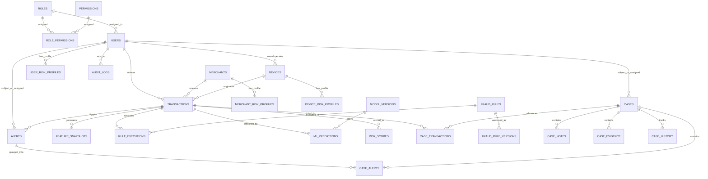

# Entity Relationship Diagram (ERD) & Relational Model

This document specifies the complete production-grade relational database architecture implemented for the **Real-Time Fraud & Anomaly Detection Platform** (Section 02).

## High-Level Relational Diagram (Mermaid)

## Relational Invariants & Integrity Rules

1. **Transaction Integrity**: Every `transaction` record references a valid `user_id`, optional `merchant_id` (or indexed `merchant_name`), and optional `device_id`.
2. **Deterministic & ML Explainability**: Every evaluation against a transaction generates a permanent audit trail via `rule_executions`, `ml_predictions`, and `risk_scores` linked with foreign keys and cascade rules.
3. **Investigation Lifecycles**: Cases aggregate both alerts (`case_alerts`) and direct transactions (`case_transactions`) alongside auditable notes (`case_notes`), tamper-evident timeline events (`case_history`), and structured artifacts (`case_evidence`).
4. **Zero Anonymous Mutations**: Notes, historical changes, evidence uploads, and system configurations capture authenticated `author_id` or `actor_user_id`.
