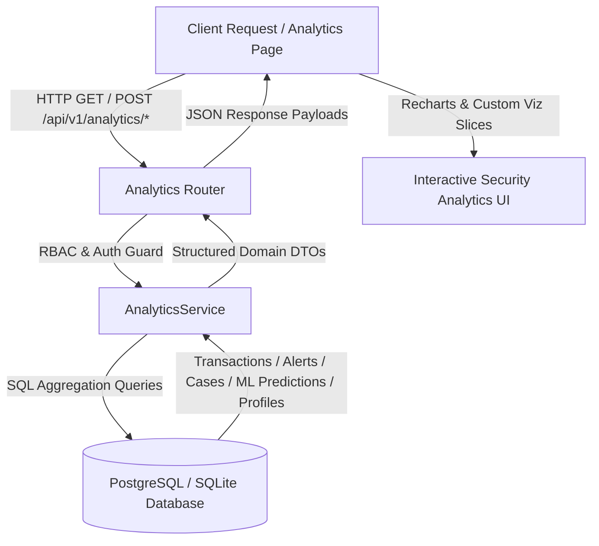

# Analytics & Visualization Engine Architecture

## 1. Overview & System Purpose

The **Analytics & Visualization Engine** provides multi-dimensional, read-only analytical intelligence across real-time transaction ingestion, fraud rule execution, machine learning anomaly scoring, security alert management, investigation case lifecycle, geographic flows, and entity behavioral patterns.

It powers executive monitoring dashboards and deep-dive forensic discovery workspaces with server-side aggregated SQL queries, configurable time windows, robust RBAC boundaries, and structured visualization feeds.



---

## 2. Core Subsystems & Endpoints

### 2.1 Analytics Router Endpoints (`/api/v1/analytics`)

| Endpoint | Method | Description | RBAC Scope |
| :--- | :--- | :--- | :--- |
| `/overview` | GET | High-level executive KPIs (Txns, USD Vol, High Risk, Anomaly Rate, Alerts, Cases, Users) | All Authenticated |
| `/transactions` | GET | Time-series throughput, status breakdown, merchant categories, payment methods, and currency distributions | All Authenticated |
| `/risk` | GET | Average risk score, risk level tiers, 0–100 decile histogram, and risk timeline trends | All Authenticated |
| `/alerts` | GET | Alert generation vs resolution trends, severity and status distributions, top reasons, and MTTR resolution metrics | All Authenticated |
| `/ml` | GET | Isolation Forest anomaly score histogram, prediction counts, and active model version performance | All Authenticated |
| `/rules` | GET | Rule engine execution volume, total triggers, overall trigger rate, and top triggered rules ranking | All Authenticated |
| `/cases` | GET | Case lifecycle state pipeline, creation vs resolution trends, resolution findings, and analyst workload distribution | RBAC Protected (Analyst/Admin) |
| `/geographic` | GET | Country ranking (volume, high-risk counts, risk %) and top metropolitan city activity | All Authenticated |
| `/entities` | GET | Top merchants by flow and risk concentration, plus shared/high-velocity device fingerprint patterns | All Authenticated |

---

## 3. Multi-Currency Financial Safety

Financial volume summaries are grouped by individual transaction currencies (`CurrencyVolumeSummary`) to prevent inaccurate summation of mixed currencies without explicit foreign exchange rates:

```json
{
  "currencies": [
    {
      "currency": "USD",
      "total_volume": 1250000.0,
      "flagged_volume": 42000.0,
      "transaction_count": 850
    },
    {
      "currency": "EUR",
      "total_volume": 320000.0,
      "flagged_volume": 1200.0,
      "transaction_count": 190
    }
  ]
}
```

---

## 4. Date Range & Time Boundary Processing

The engine supports dynamic time-range presets as well as custom ISO-8601 temporal boundaries:
- **Range Presets:** `today`, `yesterday`, `7d`, `30d`, `90d`, `this_month`, `previous_month`.
- **Custom Range:** `date_from` and `date_to` parameters in ISO format with automatic URL-encoding space sanitization (`+` vs ` `).

---

## 5. Security & RBAC Enforcement

1. **Case Analytics Isolation:**
   - Users with `viewer` role receive zeroed case statistics and `null` analyst workloads.
   - Users with `analyst` or `admin` roles receive complete lifecycle telemetry and active workload breakdowns.
2. **Audit & Non-Mutating Isolation:**
   - All analytics endpoints perform read-only aggregation queries against production tables without modifying state.

---

## 6. Frontend Visual Architecture

The frontend (`frontend/src/pages/Analytics.tsx`) delivers a SOC-grade analytical workspace with:
1. **Global Filter Bar (`AnalyticsFilters.tsx`):** Range presets, custom date/time inputs, currency, status, risk tier, and severity filters with URL query synchronisation.
2. **Executive Overview (`AnalyticsKPICards.tsx`):** Glassmorphic summary metric cards.
3. **Transaction Flow Visualizer (`TransactionCharts.tsx`):** Area time-series charts, status donut charts, and merchant sector horizontal bar charts.
4. **Risk Decile Inspector (`RiskDistributionCharts.tsx`):** 0–100 risk score histogram with color thresholds and average risk timelines.
5. **Alert & MTTR Monitor (`AlertAnalyticsSection.tsx`):** Severity distribution and MTTR mean-time-to-resolution benchmarking.
6. **ML Model & Rule Diagnostics (`MLAndRuleAnalyticsSection.tsx`):** Isolation Forest decision function histograms and fraud rule efficiency rankings.
7. **Investigation & Operations (`CaseAndWorkloadSection.tsx`):** Case creation vs resolution velocity and analyst workload distribution.
8. **Geographic & Entity Intelligence (`GeographicAndEntitySection.tsx`):** International risk ranking and shared device fingerprint analysis.
