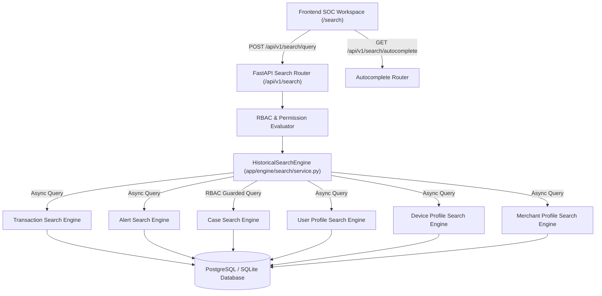

# Section 17 — Historical & Cross-Entity Search Architecture

## 1. Executive Summary

The **Historical & Cross-Entity Search System** provides security analysts, investigators, and compliance officers with a centralized, unified search engine across all persisted security entities:
1. **Transactions** (`transactions` table)
2. **Alerts** (`alerts` table)
3. **Investigation Cases** (`cases` table)
4. **User Behavioral Profiles** (`user_profiles` table)
5. **Device Profiles** (`device_profiles` table)
6. **Merchant Profiles** (`merchant_profiles` table)

The engine enforces **role-based access control (RBAC)** at the database query layer, prevents SQL injection using parameterized SQLAlchemy abstractions, calculates deterministic relevance ranking scores, and supports millisecond autocomplete lookups and deep cross-module navigation.

---

## 2. Search Engine Architecture

---

## 3. Deterministic Relevance Scoring

Search ranking is fully explainable and deterministic without artificial black-box weights:

| Match Category | Score Weight | Description |
| :--- | :--- | :--- |
| **Exact Identifier Match** | `3.0` | Exact match against `id`, `user_id`, `device_id`, or `merchant_id` |
| **Strong Field Match** | `2.0` | Exact or strong substring match in `merchant_name`, `title`, or `user_name` |
| **Partial Text Match** | `1.0` | Case-insensitive `ILIKE` wildcard match across indexed descriptive fields |

---

## 4. Multi-Dimensional Search Filters

The search engine supports simultaneous combination of filters:
- **Query String (`q`)**: Normalized, trimmed, sanitized text or identifier.
- **Entity Type Filtering (`entity_types`)**: List of categories (`transactions`, `alerts`, `cases`, `users`, `devices`, `merchants`).
- **Date Boundaries (`date_from`, `date_to`)**: ISO8601 timestamps validated with `date_from <= date_to`.
- **Risk Score Bounds (`risk_min`, `risk_max`)**: Validated integer/float ranges `[0, 100]`.
- **Risk Band Level (`risk_level`)**: Categorical filter (`LOW`, `MEDIUM`, `HIGH`, `CRITICAL`).
- **Status Filtering (`status`)**: Enforces specific entity lifecycles (e.g. `COMPLETED`, `FLAGGED`, `RESOLVED`, `CLOSED`).
- **Severity Filtering (`severity`)**: Multi-level alert and case severity filters.
- **Monetary Amount Bounds (`min_amount`, `max_amount`)**: Exact bounded query against transaction values.
- **Geographic Filters (`country`, `city`)**: Case-insensitive substring matching.
- **Sorting Options (`sort_by`)**: `relevance`, `newest`, `oldest`, `risk_desc`, `amount_desc`.
- **Server-Side Pagination (`page`, `page_size`)**: Bounded pagination (`page_size <= 100`).

---

## 5. Security & RBAC Isolation

1. **Case Access Control**:
   - `Viewer` role cannot search, count, or retrieve investigation cases.
   - `Analyst` and `Admin` roles have full search access to case records.
2. **SQL Injection Resilience**:
   - Raw user input is never formatted directly into SQL strings.
   - All queries use parameterized SQLAlchemy `where()`, `or_()`, `and_()`, and `ilike()` expressions.
3. **Data Minimization**:
   - PII, passwords, hashed credentials, and internal secret tokens are excluded from all search response schemas.
4. **Resource Protection**:
   - Page size is clamped to a maximum of 100 items per entity category per request.

---

## 6. API Endpoints

### 1. `POST /api/v1/search/query`
Executes multi-dimensional search with full filter payload.
- **Request Body**: `SearchQueryRequest`
- **Response**: `SearchResponse` (with categorized item lists, totals, and timing metadata).

### 2. `GET /api/v1/search`
URL-query-parameterized search endpoint for shareable, bookmarkable links.
- **Query Params**: `q`, `entity_types`, `date_from`, `date_to`, `risk_min`, `risk_max`, `status`, `severity`, `page`, `page_size`, `sort_by`.

### 3. `GET /api/v1/search/autocomplete`
Fast, lightweight endpoint returning top matching identifiers and entity types for interactive search bars.
- **Query Params**: `q` (string, min length 1), `limit` (int, default 8).
- **Response**: `List[AutocompleteSuggestion]`.

---

## 7. Frontend Integration (`/search`)

- **Route**: `/search` protected by authentication wrapper in `App.tsx`.
- **Components**:
  - `SearchBar.tsx`: Debounced keyboard-navigable autocomplete bar.
  - `SearchFilters.tsx`: Advanced filter panel with entity pills, risk sliders, date presets, and status badges.
  - `SearchResults.tsx`: Categorized result cards with risk scores and direct deep navigation links:
    - Transaction $\rightarrow$ `/transactions/:id`
    - Alert $\rightarrow$ `/alerts/:id`
    - Case $\rightarrow$ `/cases/:id`
    - User $\rightarrow$ `/risk-profiles?tab=users&id=:user_id`
    - Device $\rightarrow$ `/risk-profiles?tab=devices&id=:device_id`
    - Merchant $\rightarrow$ `/risk-profiles?tab=merchants&id=:merchant_id`
