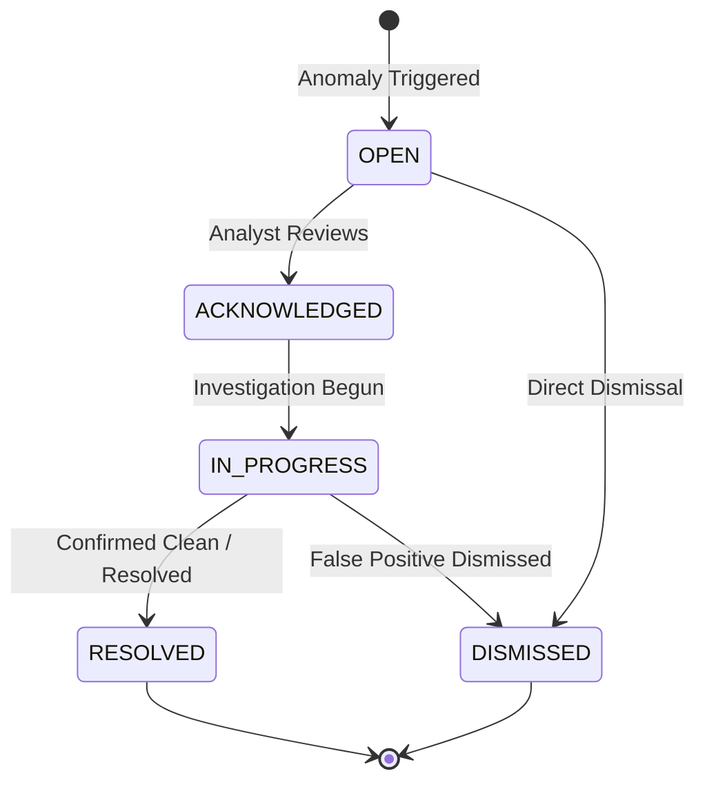

# 05 — Alert Center & Triage Operations

## 1. Overview

The **Alert Center** (`/alerts`) is the primary operational workspace where security analysts triage, investigate, acknowledge, assign, and resolve automated alerts generated by the risk engine.

---

## 2. Alert Lifecycle & Status Transitions

Alerts follow a strict state machine:



### Status Definitions:
- **`OPEN`**: New unreviewed alert created by the system.
- **`ACKNOWLEDGED`**: Analyst has claimed or acknowledged the alert.
- **`IN_PROGRESS`**: Active investigation underway, or escalated into an active case.
- **`RESOLVED`**: Investigation complete, mitigation actions applied.
- **`DISMISSED`**: Reviewed and marked as false positive or benign noise.

---

## 3. Severity & Priority Classification

- **`CRITICAL` (Score 90–100)**: Immediate operational threat. Rapid multi-thousand dollar bursts, geographical hops exceeding aircraft speeds, or known compromised accounts.
- **`HIGH` (Score 70–89)**: Serious deviation. Multiple triggered rules or high ML anomaly score requiring triage within 15 minutes.
- **`MEDIUM` (Score 30–69)**: Elevated risk. First-time device with slightly above average spending.
- **`LOW` (Score < 30)**: Informational notification or minor anomaly.

---

## 4. Analyst Investigation Workflow

```text
Step 1: Open Alert Center from the sidebar.
Step 2: Filter by Severity: CRITICAL and Status: OPEN.
Step 3: Click an alert row to inspect details.
Step 4: Review Trigger Reasons and Linked Transaction Evidence.
Step 5: Click "Acknowledge" to claim the alert.
Step 6: If suspicious activity is confirmed, click "Create Case" to begin a formal investigation.
Step 7: If legitimate consumer activity is confirmed, click "Dismiss" and provide a brief justification reason.
```
