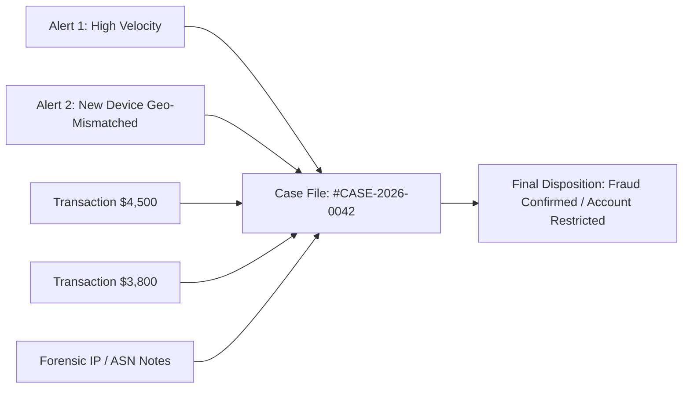
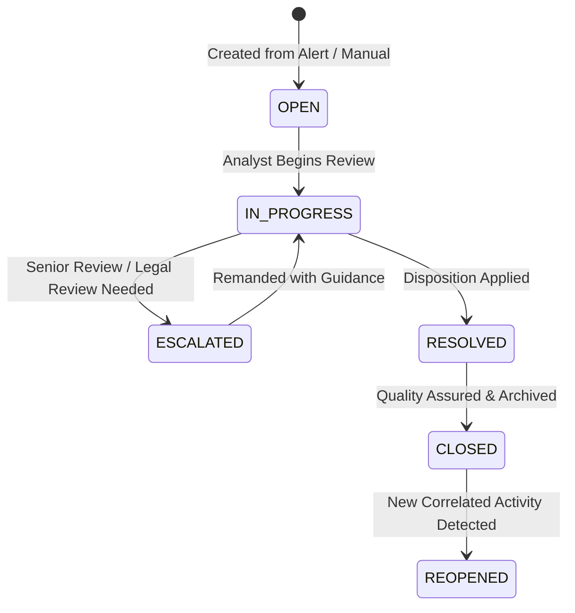

# Case Management Guide

The **Case Management** module provides an investigation and workflow hub within the **Finance & Security: Real-Time Fraud & Anomaly Detection Platform**. While an **Alert** represents an individual detection signal for a single transaction or event, a **Case** serves as a collaborative case file aggregating multiple alerts, transactions, forensic evidence items, structured timeline notes, and analyst dispositions.

---

## 1. Overview & Concepts

### Key Difference: Alert vs. Case
| Dimension | Alert | Case |
| :--- | :--- | :--- |
| **Scope** | Single triggering event / transaction | Multi-event investigation container |
| **Lifecycle** | `OPEN` → `ACKNOWLEDGED` → `IN_PROGRESS` → `RESOLVED` / `DISMISSED` | `OPEN` → `IN_PROGRESS` → `ESCALATED` → `RESOLVED` / `CLOSED` (or `REOPENED`) |
| **Evidence** | Rule signals & ML anomaly scores | Aggregated transactions, external files/hashes, user timeline notes |
| **Ownership** | Assigned analyst or unassigned queue | Dedicated primary assignee & collaborators |

---

## 2. Navigating the Case Center

1. Click **Cases** in the main sidebar navigation (Route: `/cases`).
2. The Case List presents a sortable, filterable table of all active and closed investigations.

### Case Filter Controls
* **Status Filter**: Filter by `OPEN`, `IN_PROGRESS`, `ESCALATED`, `RESOLVED`, or `CLOSED`.
* **Priority Filter**: Filter by `CRITICAL`, `HIGH`, `MEDIUM`, or `LOW`.
* **Assignee Filter**: Filter to view cases assigned to yourself or unassigned queue items.
* **Search Bar**: Query by Case ID (UUID/Display ID), Title, User ID, or Merchant ID.

---

## 3. Creating a New Investigation Case

Cases can be created directly from an Alert detail screen or manually via the Case Center:

### Manual Creation Steps
1. Navigate to `/cases` and click the **Create Case** button in the top-right toolbar.
2. Complete the modal form:
   * **Title**: Descriptive title (e.g., `Suspicious Card Cycling - User 98214`).
   * **Priority**: Select initial urgency (`LOW`, `MEDIUM`, `HIGH`, `CRITICAL`).
   * **Category**: Classification (e.g., `ATO`, `Velocity Abuse`, `Merchant Collusion`, `AML Threshold`).
   * **Description**: Background synopsis explaining the rationale for the investigation.
   * **Initial Assignee**: Assign to yourself or leave unassigned for triage.
3. Click **Submit**. You will be automatically redirected to the newly created Case Detail view.

---

## 4. Case Detail Workspace

The Case Detail page (`/cases/:id`) is organized into dedicated operational tabs:

### 4.1 Case Header & Metadata
* **Status Pill & Priority Badge**: Visual indicators with immediate dropdown actions to change status or escalate priority.
* **Assignee Selector**: Reassign ownership or transfer cases between analysts.
* **Timeline Timestamps**: Tracks `Created At`, `Last Updated`, and `Resolved At`.

### 4.2 Linked Alerts & Transactions
* **Linked Alerts Tab**: Lists all automated detection alerts associated with this case file. Analysts can link additional alerts or unlink false positives.
* **Linked Transactions Tab**: Displays full transaction rows with risk scores, timestamps, and currency amounts. Clicking any transaction row navigates directly to the Transaction Explorer deep inspector.

### 4.3 Evidence Locker
* Allows investigators to attach external data artifacts, suspicious IP ranges, merchant identifiers, chargeback dispute numbers, or screenshot references.
* Each piece of evidence records:
  * **Evidence Type**: String identifier (e.g., `IP_CLUSTER`, `DEVICE_FINGERPRINT`, `POLICE_REPORT`).
  * **Payload / Value**: Content, identifier, or cryptographic checksum.
  * **Added By & Timestamp**: Full audit trail of the contributing investigator.

### 4.4 Investigative Notes & Audit Timeline
* Chronological record of all analyst comments and automated system milestones.
* **Adding Notes**: Enter rich investigative notes in the comment box and click **Add Note**. Notes cannot be tampered with or deleted, ensuring strict forensic integrity.

---

## 5. Investigation Lifecycle & Disposition

### Supported Final Dispositions
When transitioning a case to `RESOLVED` or `CLOSED`, investigators select a disposition tag:
* **CONFIRMED_FRAUD**: Malicious activity verified (e.g., Account Takeover, Stolen Card).
* **FALSE_POSITIVE**: Benign customer behavior verified (e.g., legitimate travel, abnormal gift purchase).
* **SUSPICIOUS_UNCONFIRMED**: Inconclusive evidence; customer placed on heightened monitoring.
* **POLICY_VIOLATION**: Non-fraud breach of terms of service.

---

## 6. Role Permissions Matrix for Cases

| Action | Viewer | Analyst | Administrator |
| :--- | :---: | :---: | :---: |
| View Case List & Details | ✓ | ✓ | ✓ |
| Create New Case | ✗ | ✓ | ✓ |
| Link Alerts / Transactions | ✗ | ✓ | ✓ |
| Add Notes & Evidence | ✗ | ✓ | ✓ |
| Change Status & Priority | ✗ | ✓ | ✓ |
| Reassign Case Ownership | ✗ | ✓ | ✓ |
| Close / Reopen Case | ✗ | ✓ | ✓ |
