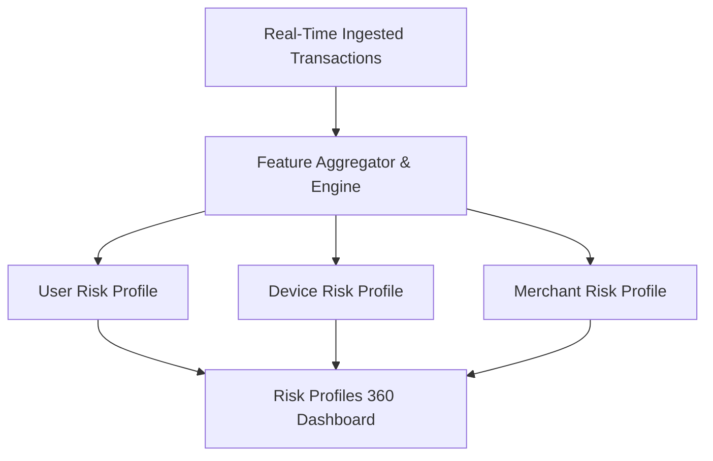

# Risk Profiles & Entity Intelligence Guide

The **Risk Profiles** module provides continuous, 360-degree behavioral risk baselines across the platform's core entities: **Users**, **Devices**, and **Merchants**. Unlike point-in-time transaction evaluations, entity risk profiles aggregate historical telemetry, rolling velocity metrics, anomaly frequencies, and threat signals over dynamic sliding time windows.

---

## 1. Accessing Risk Profiles

1. Click **Risk Profiles** in the sidebar navigation (Route: `/risk-profiles`).
2. Select the target entity tab:
   * **User Profiles**
   * **Device Profiles**
   * **Merchant Profiles**
3. Use the search bar to query specific identifiers (e.g., `usr_981273`, `dev_fingerprint_8819`, `merch_corp_412`).

---

## 2. User Risk Profiles

A **User Risk Profile** models the behavioral patterns, typical spending habits, and credential associations of an individual account holder.

### Key Profile Metrics
* **Calculated Baseline Score (0–100)**: Composite risk indicator reflecting recent alert volume, anomaly severity, and velocity flags.
* **Transaction Velocity**: Number and volume of transactions executed across 1-hour, 24-hour, and 7-day sliding windows.
* **Typical Spend Range**: Average transaction amount and standard deviation. Large positive deviations flag transaction amount anomalies.
* **Known Devices & Geographies**: List of authorized device fingerprints and common IP geolocation coordinates (City/Country).
* **Associated Alert Count**: Count of active and historical alerts generated against this user ID.

---

## 3. Device Risk Profiles

A **Device Risk Profile** tracks hardware and browser fingerprints across transactions. It helps detect device spoofing, bot networks, emulator farms, and credential stuffing attacks across multiple user accounts.

### Key Profile Metrics
* **Device Trust Score (0–100)**: Score derived from device consistency, jailbreak/root indicators, and multi-user association.
* **Associated User Accounts**: Number of distinct user accounts transacting through this unique device ID. Multiple accounts on one device is a strong indicator of account takeover or synthetic fraud.
* **Device Characteristics**:
  * User Agent & Browser Signature
  * Operating System & Version
  * Screen Resolution & WebGL Fingerprint
  * IP Geolocation History & VPN/Proxy Detection
* **Transaction Failure Rate**: Percentage of declined or failed payment attempts originating from this device.

---

## 4. Merchant Risk Profiles

A **Merchant Risk Profile** evaluates merchant accounts, processing categories, and terminal endpoints to detect merchant-side collusion, transaction laundering, and elevated chargeback risk.

### Key Profile Metrics
* **Merchant Category Code (MCC)**: High-risk merchant category classification (e.g., crypto exchanges, gambling, digital goods, luxury retail).
* **Volume Velocity & Average Ticket**: Aggregate processing volume and distribution of transaction sizes.
* **Dispute & Alert Ratio**: Percentage of total processed transactions that triggered high/critical severity alerts.
* **Unique Cardholder Count**: Ratio of unique user cards to total transactions (abnormal clustering can indicate stolen card testing).

---

## 5. Interpreting Entity Risk in Investigations

> [!IMPORTANT]
> **Profile Context vs. Transaction Score**:
> An individual transaction might trigger a low score in isolation (e.g., a standard $25 grocery purchase), but if executed on a **Device Profile** associated with 40 distinct user accounts in the last 2 hours, the broader investigation warrants critical urgency.

### Investigation Best Practice
When analyzing a suspicious transaction or alert:
1. Click the **User ID** or **Device ID** chip in the Transaction Inspector.
2. Review the entity profile's historical velocity and known device count.
3. If the device has never been seen for that user before and the transaction occurred outside typical active hours, escalate the case for potential Account Takeover (ATO).
