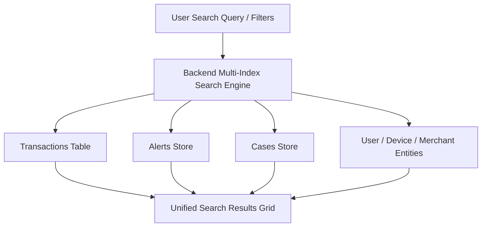

# Historical Search & Entity Investigation Guide

The **Historical Search** module provides forensic querying capabilities across all stored entities, transactions, alerts, investigation cases, and risk profiles in the **Finance & Security: Real-Time Fraud & Anomaly Detection Platform**.

---

## 1. Accessing Historical Search

1. Click **Search** in the sidebar navigation (Route: `/search`).
2. The search workspace provides:
   * **Universal Query Bar**: Supports exact match identifiers and substring lookups.
   * **Target Entity Selector**: Filter query scope to specific entities.
   * **Multi-Parameter Facet Filters**: Narrow results by time, risk band, currency, and status.

---

## 2. Supported Search Entities

Investigators can target search queries across the following entity types:

| Entity Type | Supported Query Attributes |
| :--- | :--- |
| **Transactions** | Transaction ID, User ID, Device ID, Merchant ID, Amount Range, Risk Score Range |
| **Alerts** | Alert ID, Transaction ID, Severity (`CRITICAL`, `HIGH`, etc.), Rule ID, Status |
| **Cases** | Case ID, Case Title, Assignee User ID, Priority, Disposition Status |
| **Users** | User ID, Email, Phone, Behavioral Risk Baseline |
| **Devices** | Device Fingerprint ID, Browser Family, Operating System, IP Address |
| **Merchants** | Merchant ID, Merchant Category Code (MCC), Risk Level |

---

## 3. Search Filters & Syntax

### Multi-Parameter Filter Options
* **Time Range Selector**: Predefined windows (`Last 1 Hour`, `Last 24 Hours`, `Last 7 Days`, `Last 30 Days`) or custom start/end timestamps.
* **Risk Score / Band Filter**: Filter transactions by exact threshold (e.g., Score $\ge 70$) or category (`LOW`, `MEDIUM`, `HIGH`, `CRITICAL`).
* **Amount & Currency Range**: Filter by transaction volume (Min/Max amount) and currency code (`USD`, `EUR`, `GBP`, `CAD`, etc.).
* **Investigation Status**: For alerts and cases, filter by operational state (`OPEN`, `RESOLVED`, `CLOSED`).

---

## 4. Query Execution & Results Grid

1. Enter your search query or select filter criteria.
2. Click **Execute Search** (or press `Enter`).
3. Results are returned in an indexed table format with:
   * **Entity Badge**: Displays entity type (`TX`, `ALERT`, `CASE`, `USER`, `DEVICE`, `MERCHANT`).
   * **Primary Identifier**: Clickable link leading directly to the full inspector view.
   * **Risk Assessment**: Color-coded risk score badge.
   * **Timestamp**: Exact UTC and localized transaction/creation time.
   * **Quick Action Toolbar**: One-click actions to open detailed view, copy ID to clipboard, or link to an active case.

---

## 5. Tips for Effective Forensic Queries

* **Investigating Card-Not-Present Fraud Clusters**: Search by `Merchant ID` over the `Last 24 Hours` with Risk Filter set to `HIGH` or `CRITICAL`.
* **Correlating Stolen Device Multi-Account Abuse**: Search by exact `Device Fingerprint ID` without restricting by User ID to reveal all accounts accessed via that terminal.
* **Tracking Account Takeover (ATO) Velocity**: Search by target `User ID` across `All Entities` to review the chronological progression of transactions, alerts, and open cases.
