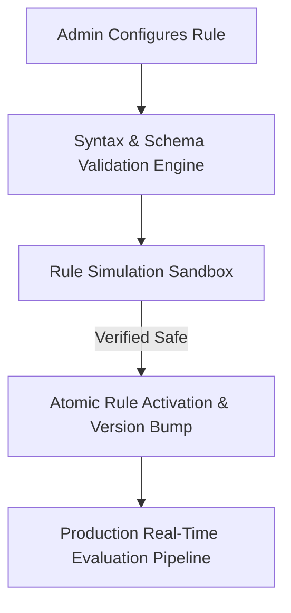

# Fraud Rules Administration & Simulation Guide

The **Rule Administration** module empowers authorized **Administrators** to configure, update, test, version, and simulate deterministic fraud detection rules in real-time. Changes made to rules take effect immediately for future transactions without requiring backend server restarts.

---

## 1. Accessing Rule Administration

1. Click **Administration** in the main sidebar, then select **Rules Management** (Route: `/admin/rules`).
2. Only users with the `admin` role have write access. `analyst` and `viewer` roles have read-only access.

---

## 2. Rule Configuration Schema & Attributes

Each detection rule consists of defined configuration fields:

| Field | Description | Example |
| :--- | :--- | :--- |
| **Rule ID** | Unique programmatic slug identifier | `RULE_HIGH_VELOCITY_1H` |
| **Rule Name** | Human-readable title | High Velocity (1 Hour Window) |
| **Description** | Rationale and logic summary | Triggers if a user executes $\ge 5$ transactions within 1 hour |
| **Category** | Classification grouping | `VELOCITY`, `AMOUNT`, `GEOGRAPHY`, `DEVICE`, `BEHAVIOR` |
| **Condition (Logic)** | Logical expression evaluated against transaction features | `velocity_1h >= 5 and amount > 100` |
| **Score Contribution** | Numerical risk score added to transaction composite (0–100) | `35.0` |
| **Severity** | Operational alert severity if threshold crossed | `HIGH` |
| **Status** | Active toggle state | `ACTIVE` / `INACTIVE` |
| **Version** | Monotonically increasing version number | `v1.3` |

---

## 3. Creating & Editing Detection Rules

### Step-by-Step Rule Creation
1. Navigate to `/admin/rules` and click **Create Rule**.
2. Complete the Rule Editor modal:
   * Specify **Name**, **Rule ID**, and **Category**.
   * Define the **Condition Expression** using supported feature variables:
     * `amount`, `currency`, `user_id`, `device_id`, `merchant_category`
     * `velocity_1h`, `velocity_24h`, `velocity_7d`
     * `avg_amount_7d`, `amount_deviation_ratio`
     * `is_new_device`, `is_vpn_proxy`, `geo_distance_km`
   * Set **Score Weight** and default **Severity**.
3. Click **Validate Syntax**. The built-in validator will check for syntax errors or invalid feature tokens.
4. Click **Save Rule**. The rule will be saved with status `INACTIVE` until simulated and activated.

---

## 4. Rule Simulation Sandbox

Before deploying a rule to live transaction processing, administrators should run synthetic simulations to verify behavior.

### Running a Simulation
1. On the Rule Detail or Edit page, navigate to the **Simulation Sandbox** pane.
2. Enter synthetic transaction JSON payload or select a preset test scenario (e.g., *Normal Checkout*, *Rapid Fire Velocity*, *Impossible Travel*).
3. Click **Execute Simulation**.
4. The simulation results display:
   * **Triggered**: `TRUE` or `FALSE`
   * **Score Increment**: Calculated points added
   * **Execution Latency**: Time in milliseconds taken to evaluate the expression
   * **Feature Extraction Log**: Values parsed from the synthetic payload

> [!IMPORTANT]
> **Production Safety Guarantee**:
> Executing a simulation in the Rule Sandbox is purely in-memory. It will **never** create production alerts, modify database records, or impact live transaction scoring.

---

## 5. Rule Versioning & Activation

* **Immutable Version History**: Every time an existing rule's condition, weight, or threshold is modified, the system creates a new version record (`v1`, `v2`, `v3`).
* **Instant Activation**: Toggling a rule to `ACTIVE` immediately loads it into the evaluation cache. All subsequent transactions evaluated by the ingestion pipeline will apply the updated rule version.
* **Audit Trail**: Every rule creation, modification, activation, or deactivation creates an immutable entry in the system **Audit Logs** with the administrator's identity and timestamp.
