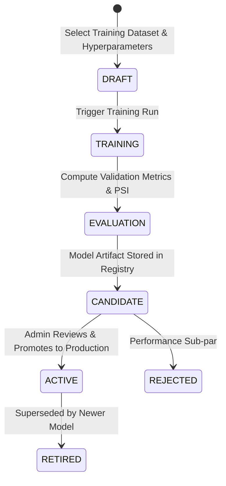

# Machine Learning Monitoring & Retraining Guide

The **Machine Learning (ML) Monitoring & Retraining** module provides oversight of the unsupervised and supervised anomaly detection models operating within the **Finance & Security: Real-Time Fraud & Anomaly Detection Platform**. It tracks model health, inference latency, prediction drift, data distribution shifts (Population Stability Index - PSI), and provides model retraining workflows.

---

## 1. Accessing ML Monitoring

1. Click **ML Models** in the sidebar navigation (Route: `/models`).
2. The ML Dashboard provides three primary operational tabs:
   * **Active Models & Telemetry**
   * **Drift & Data Quality Monitoring**
   * **Model Retraining & Lifecycle**

---

## 2. Active Model Registry & Telemetry

The platform supports multiple concurrent anomaly detection models (e.g., *Isolation Forest Anomaly Detector*, *Autoencoder Anomaly Model*).

### Telemetry & Operational Metrics
| Metric | Description | Target Health Baseline |
| :--- | :--- | :--- |
| **Model Status** | Current deployment state (`ACTIVE`, `CANDIDATE`, `RETIRED`) | Must be `ACTIVE` for live scoring |
| **Prediction Volume** | Total inference requests processed in current window | Matches transaction throughput |
| **Anomaly Flag Rate** | Percentage of transactions flagged with high anomaly score ($>0.70$) | Typically 1.0% – 5.0% depending on population |
| **Average Inference Latency**| Real-time inference execution time per transaction | $< 15\text{ ms}$ |
| **Inference Error Rate** | Percentage of failed inference calls (falls back to heuristic engine) | $0.00\%$ |

---

## 3. Drift & Data Quality Monitoring

To ensure anomaly models remain accurate as transaction distributions evolve, the platform continuously computes statistical drift metrics:

```mermaid
flowchart LR
    BT[Baseline Training Distribution] --> DC[Drift Calculator (PSI & KS-Test)]
    LT[Live Transaction Stream Features] --> DC
    DC --> PSI[Population Stability Index (PSI)]
    PSI -->|PSI < 0.10| OK[Green: Distribution Stable]
    PSI -->|0.10 <= PSI < 0.25| WARN[Amber: Moderate Shift / Monitor]
    PSI -->|PSI >= 0.25| ALERT[Red: Significant Drift / Retrain Recommended]
```

### Monitored Feature Distributions
* **Amount Distribution**: Kolmogorov-Smirnov (KS) test tracking shifts in spending magnitudes.
* **Velocity Distributions**: Rolling 1h/24h transaction counts compared against training baselines.
* **Categorical Feature Shifts**: Chi-square tests monitoring shifts in currency codes and merchant category distributions.

> [!NOTE]
> **Supervised vs. Unsupervised Metrics**:
> Supervised metrics such as Precision, Recall, and AUC-ROC are available when confirmed chargeback ground-truth labels are ingested. For unsupervised Isolation Forest models, operational health relies on Anomaly Rate stability, Score Distribution, and PSI drift calculations.

---

## 4. Model Retraining Workflow

When significant feature drift is detected or new ground-truth fraud labels have been collected, administrators can initiate a model retraining cycle.



### Steps to Retrain a Model
1. In `/models`, click the **Model Retraining** tab.
2. Click **Initiate Retraining Job**.
3. Configure the job parameters:
   * **Model Architecture**: Select algorithm (e.g., `IsolationForest`, `Autoencoder`).
   * **Training Data Window**: Choose historical window (e.g., `Last 90 Days`).
   * **Contamination / Outlier Ratio**: Set expected anomaly fraction (default: `0.02`).
   * **Hyperparameters**: `n_estimators`, `max_samples`, `random_state`.
4. Click **Start Training**. The backend initiates a background training worker.
5. Monitor training progress in the **Retraining Jobs Table**.
6. Once complete, review the generated **Validation Report** (Drift comparison, anomaly score distribution curve, inference benchmark).
7. If satisfactory, click **Promote to Active**. The platform atomically swaps the active production model without service downtime.

---

## 5. Permissions

* **Viewer & Analyst**: Full read-only visibility into model performance, telemetry charts, and drift metrics.
* **Administrator**: Exclusive permission to trigger retraining jobs, adjust contamination hyperparameters, and promote candidate models to active production.
