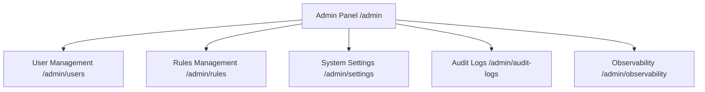

# Administration, Security Governance & Audit Logs Guide

The **Administration Panel** provides administrative controls, user account management, role-based access control (RBAC), global system configuration, tamper-evident audit logging, and platform observability for the **Finance & Security: Real-Time Fraud & Anomaly Detection Platform**.

> [!WARNING]
> Access to the `/admin/*` routes is strictly restricted to accounts with the `admin` role. Unauthorized access attempts are blocked and logged in the immutable security audit trail.

---

## 1. Administration Navigation Overview

Navigating to **Administration** in the sidebar (Route: `/admin`) provides access to the following administrative subsections:

1. **Admin Overview** (`/admin`): High-level system posture, active user sessions, ingestion health, and audit summaries.
2. **User Management** (`/admin/users`): Account provisioning, password resets, role assignment, and account activation/suspension.
3. **Fraud Rules Administration** (`/admin/rules`): Rule engine authoring, simulation, and activation.
4. **System Settings** (`/admin/settings`): Global risk engine thresholds, alert deduplication windows, session timeout, and rate-limiting configurations.
5. **Audit Logs** (`/admin/audit-logs`): Comprehensive forensic activity logs.
6. **Observability & Health** (`/admin/observability`): Real-time CPU/memory utilization, database connection pools, Redis cache latency, and Prometheus metric exporters.

---

## 2. User Management (`/admin/users`)

Administrators manage user accounts and assign least-privilege security roles.

### User Account Actions
* **Create New User**:
  1. Click **Add User**.
  2. Enter Username, Full Name, Email Address, and temporary Initial Password.
  3. Assign Role (`admin`, `analyst`, or `viewer`).
  4. Click **Create User**.
* **Edit User & Role Assignment**: Modify user email, display name, or change RBAC role.
* **Activate / Suspend User**: Instantly toggle account status (`ACTIVE` vs. `SUSPENDED`). Suspended accounts have their active JWT session revoked immediately.
* **Reset Password**: Generate a secure temporary credential for an analyst or user.

---

## 3. System Settings (`/admin/settings`)

The System Settings panel controls global detection parameters:

| Configuration Setting | Description | Default Value |
| :--- | :--- | :--- |
| **Risk Band Thresholds** | Score boundaries for `LOW`, `MEDIUM`, `HIGH`, `CRITICAL` bands | `30 / 70 / 90` |
| **Alert Trigger Threshold** | Minimum composite score required to generate an operational alert | `70.0` |
| **Alert Deduplication Window** | Cooldown window (seconds) to suppress duplicate alerts for the same user/device | `300 seconds` |
| **Session Inactivity Timeout** | Minutes before an idle user JWT session expires | `60 minutes` |
| **Ingestion Rate Limit** | Maximum transactions per second permitted per API key | `1,000 req/sec` |

---

## 4. Audit Logs (`/admin/audit-logs`)

The **Audit Logs** module records an immutable forensic record of every security-sensitive action taken across the platform to ensure compliance and accountability.

### What is Recorded in Audit Logs?
* **Timestamp**: Exact UTC timestamp of the action.
* **Actor**: Username and User ID who initiated the action.
* **Action Identifier**: Structured action code (e.g., `USER_LOGIN`, `USER_CREATED`, `RULE_UPDATED`, `CASE_STATUS_CHANGED`, `SETTINGS_MODIFIED`, `MODEL_PROMOTED`).
* **Resource Type & ID**: Target entity modified (e.g., `Rule: RULE_VELOCITY_1H`, `Case: #CASE-2026-0042`).
* **Client IP & User Agent**: Originating network IP and browser client.
* **Status / Outcome**: `SUCCESS` or `FAILURE`.
* **Changes Payload / Diff**: Structured JSON delta showing previous and updated values.

### Filtering Audit Logs
* **Actor Filter**: Search actions taken by a specific administrator or analyst.
* **Action Type Filter**: Filter by authentication events, rule changes, user modifications, or case resolutions.
* **Time Range**: Filter across custom date ranges.

---

## 5. Observability & System Health (`/admin/observability`)

Provides site reliability and operational health metrics for the platform services:
* **Database Connection Pool**: Active vs. idle PostgreSQL connections.
* **Redis Ingestion Queue & WebSocket Subscriptions**: Message throughput and buffer lag.
* **API Service Latency (P50, P95, P99)**: Sub-millisecond to millisecond response times.
* **Worker & Retraining Subsystems**: Background worker thread health.
