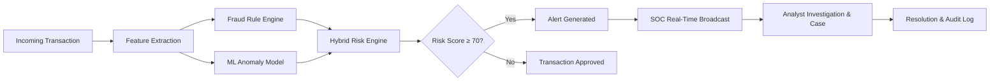

# User Documentation — Finance & Security: Real-Time Fraud & Anomaly Detection Platform

Welcome to the official User Guide for the **Finance & Security: Real-Time Fraud & Anomaly Detection Platform**. This guide provides analysts, investigators, compliance officers, and administrators with instructions on utilizing the platform's detection, investigation, analytics, and governance capabilities.

---

## 1. Platform Purpose & Overview

The platform provides financial institutions and fintech enterprises with sub-second fraud detection, machine learning anomaly scoring, real-time alert triage, collaborative case management, and regulatory audit accountability.

### Central Processing Workflow

> **Important Note on Detection Signals**:
> Numerical risk scores (0–100) and ML anomaly indicators reflect statistical behavioral deviations and rule triggers. They provide decision support for analysts and do not constitute legal determinations of fraud without verified ground truth and formal investigation.

---

## 2. Documentation Directory

| Document | Topic | Target Audience |
| :--- | :--- | :--- |
| **[01. Getting Started](./01_Getting_Started.md)** | Login, Navigation Shell, Theme Switching, Workspace Overview | All Users |
| **[02. Roles & Permissions](./02_Roles_and_Permissions.md)** | RBAC Capabilities Matrix (Viewer, Analyst, Administrator) | All Users & Compliance |
| **[03. SOC Dashboard](./03_SOC_Dashboard.md)** | Live KPI Cards, Real-Time Ingestion Feed, Risk Distributions | Analysts & Viewers |
| **[04. Transaction Explorer](./04_Transaction_Explorer.md)** | Transaction Search, Deep Inspector, Rule Signals, Feature Snapshots | Analysts & Investigators |
| **[05. Alert Center](./05_Alert_Center.md)** | Alert Triage, Severity Classification, Evidence Review, Status Lifecycle | Security Analysts |
| **[06. Case Management](./06_Case_Management.md)** | Case Creation, Alert/Transaction Linking, Evidence Notes, Resolution | Investigators & Leads |
| **[07. 360° Risk Profiles](./07_Risk_Profiles.md)** | User, Device, and Merchant Behavioral Baselines & History | Fraud Analysts |
| **[08. Historical Search](./08_Historical_Search.md)** | Cross-Entity Search across Transactions, Alerts, Cases, Users | All Users |
| **[09. Analytics & Insights](./09_Analytics_and_Insights.md)** | Multi-Currency Volume, Risk Trends, Rule Performance Analytics | Executives & Analysts |
| **[10. Fraud Rules Admin](./10_Fraud_Rules_Administration.md)** | Rule Versioning, Parameter Validation, Simulations, Atomic Activations | Administrators |
| **[11. ML Monitoring & Retrain](./11_ML_Monitoring_and_Retraining.md)**| Statistical Drift (PSI), Model Health, Candidate Retraining Gates | MLOps & Admins |
| **[12. Notification Center](./12_Notification_Center.md)** | In-App Bell Feeds, Real-Time Delivery, Severity Filtering | All Users |
| **[13. Admin & Governance](./13_Admin_Panel_and_Governance.md)** | User Lifecycle, System Thresholds, Audit Logs, Observability | Administrators |
| **[14. Security & Privacy](./14_Security_and_Privacy.md)** | Account Security, Credential Safety, Data Handling & Least Privilege | All Users |
| **[15. Troubleshooting & FAQ](./15_Troubleshooting_and_FAQ.md)** | Common Issues, Error Definitions, Terminology Glossary | All Users |

---

## 3. Core Terminology Quick Reference

- **Transaction**: A financial authorization event characterized by amount, currency, merchant, device, and location.
- **Risk Score**: A normalized score between `0` and `100` synthesized from rule evaluations, ML anomaly scores, and profile history.
- **Risk Band**: Categorical risk classification (`LOW` < 30, `MEDIUM` 30–69, `HIGH` 70–89, `CRITICAL` ≥ 90).
- **Fraud Rule**: A deterministic condition (e.g. `HIGH_AMOUNT`, `RAPID_TRANSACTIONS`, `NEW_DEVICE`) evaluated against feature context.
- **Alert**: An operational security signal generated when a transaction risk score breaches configured thresholds.
- **Case**: An investigation container grouping multiple alerts, transactions, evidence, and analyst notes.
- **Audit Log**: An immutable chronological record of all administrative, configuration, and state-change actions.
