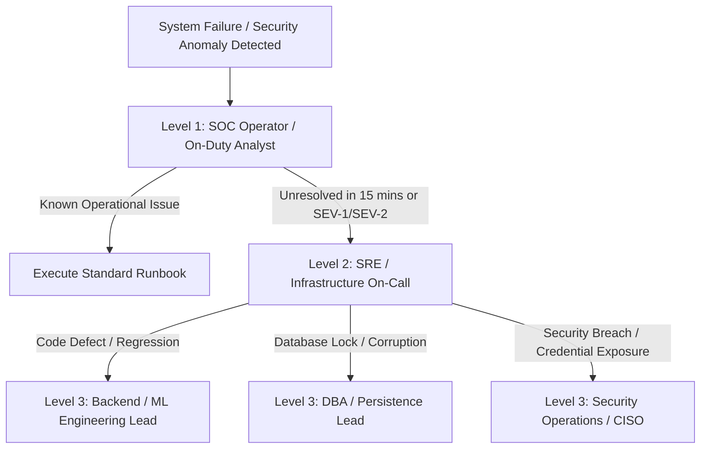

# Operational Overview & Governance

This document outlines the operational environment architecture, operational roles, escalation pathways, and service level objectives for the **Finance & Security: Real-Time Fraud & Anomaly Detection Platform**.

---

## 1. Operating Environments

The platform is maintained across three standardized environments:

```mermaid
flowchart LR
    DEV[Development / Local Environment] -->|CI Automated Build & Tests| STG[Staging Environment (docker-compose.staging.yml)]
    STG -->|Smoke Tests & Validation| PROD[Production Cluster (docker-compose.prod.yml)]
```

| Environment | Purpose | Persistence | Host Ports |
| :--- | :--- | :--- | :--- |
| **Development** | Local engineer iteration, unit testing, mock fixtures | Local SQLite / PostgreSQL | `3000` (FE), `8000` (BE) |
| **Staging** | CI pre-release validation, integration tests, performance benchmarking | Dedicated PostgreSQL Container | `3001` (FE), `8001` (BE) |
| **Production** | Live real-time transaction processing, SOC analyst operations | Isolated PostgreSQL 16 Cluster + Redis | `80 / 443` (Nginx), Internal Network |

---

## 2. Operations Roles & Responsibilities

| Role | Operational Scope | Key Responsibilities |
| :--- | :--- | :--- |
| **Site Reliability Engineer (SRE)** | Infrastructure, Containers, Ingress | Health monitoring, scaling, zero-downtime releases, disaster recovery drills |
| **Database Administrator (DBA)** | PostgreSQL & Persistence | Backup automation, index optimization, vacuuming, migration approvals |
| **MLOps Engineer** | Anomaly Models & Retraining | Model registry lifecycle, drift tracking (PSI), retraining jobs, model validation |
| **Security Engineer** | Security Hardening & RBAC | Secret rotation, certificate renewals, vulnerability scanning, audit review |
| **SOC Operations Lead** | Fraud Triage & Operational Escalations | Daily queue health, false positive tracking, incident response coordination |

---

## 3. Operational Escalation Matrix



### Escalation Thresholds
* **SEV-1 (Critical Outage)**: Automatic pager alert to SRE and Engineering Leads within 5 minutes.
* **SEV-2 (Major Degradation)**: Escalated to SRE within 15 minutes if automated recovery fails.
* **SEV-3 / SEV-4 (Minor Issue)**: Logged in operational ticket queue for triage during standard maintenance windows.
