# Daily Operations & Routine Procedures

This document provides daily operational procedures and checklists to ensure continuous stability, security, and performance of the **Finance & Security: Real-Time Fraud & Anomaly Detection Platform**.

---

## 1. Daily Operational Schedule

```mermaid
gantt
    title Daily Operational Cadence
    dateFormat HH:mm
    axisFormat %H:%M
    section Morning Shift
    System Health & Ingestion Check     :08:00, 30m
    Database & Backup Verification      :08:30, 20m
    Alert Queue & Case Backlog Triage   :08:50, 40m
    section Mid-Day Shift
    ML Model Drift & PSI Review         :13:00, 30m
    Error Log & Exception Review        :13:30, 30m
    section Evening Shift
    Daily Backup Execution & Verification:20:00, 30m
    Security Audit Logs Inspection       :20:30, 30m
    Shift Handover Briefing             :21:00, 20m
```

---

## 2. Daily Health Verification Checklist

Every morning at the start of the operational shift, on-duty operators must execute the following checks:

### 2.1 Service Health & Ingress
* [ ] Verify `GET /health` returns `{"status": "healthy"}` across all API instances.
* [ ] Verify `GET /health/ready` returns ready status for PostgreSQL and Redis dependencies.
* [ ] Inspect Nginx access logs for unusual HTTP 5xx spikes or 429 rate-limiting surges.

### 2.2 Transaction Ingestion & Latency
* [ ] Check Transaction Explorer (`/transactions`) to verify continuous real-time transaction ingestion.
* [ ] Verify P95 ingestion-to-evaluation pipeline latency is $< 25\text{ ms}$.
* [ ] Check Redis buffer lag: Ensure ingestion queue depth is near zero.

### 2.3 Detection & Alerting Health
* [ ] Check Alert Center (`/alerts`): Verify alerts are being generated for transactions with risk score $\ge 70$.
* [ ] Review unassigned alert queue to prevent alert backlog starvation.
* [ ] Confirm WebSocket real-time live feed indicator is **Connected** in the top navigation bar.

### 2.4 Database & Persistence
* [ ] Verify automated nightly backup file exists in `./backups/` or cloud storage destination.
* [ ] Verify backup archive integrity: Ensure file size matches expected baseline ($> 0\text{ bytes}$).
* [ ] Inspect active database connections in `/admin/observability` (Target: $< 70\%$ of pool max).

### 2.5 ML Model Drift & Performance
* [ ] Navigate to `/models` and inspect the active Isolation Forest model status.
* [ ] Verify Population Stability Index (PSI) is $< 0.10$ (Green / Stable).
* [ ] If PSI $\ge 0.25$, flag for candidate model retraining evaluation.

### 2.6 Security & Audit Logs
* [ ] Inspect `/admin/audit-logs` for failed administrative logins or unauthorized privilege escalation attempts.
* [ ] Verify no unhandled security exceptions occurred in backend application logs.
