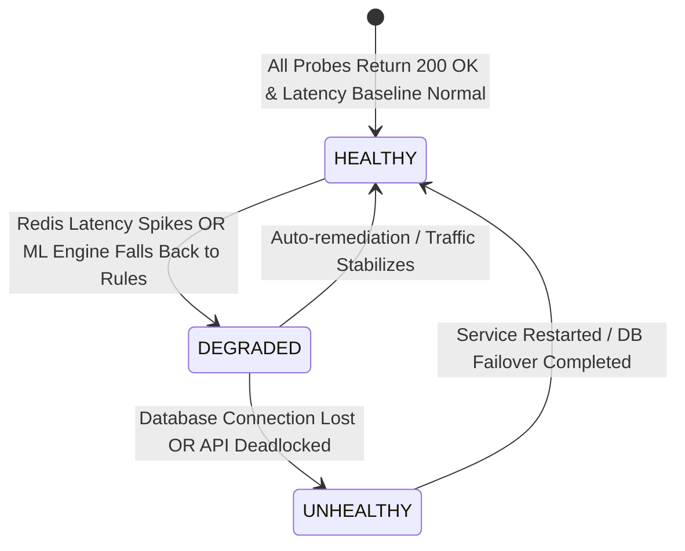

# System Health Monitoring & Observability

This document establishes the observability architecture, automated health checks, metric definitions, and alerting thresholds for the **Finance & Security: Real-Time Fraud & Anomaly Detection Platform**.

---

## 1. Health Check Endpoints

The backend provides structured HTTP health and readiness probe endpoints:

### 1.1 Liveness Probe (`GET /health`)
* **Purpose**: Verifies that the FastAPI process is responsive and serving HTTP requests.
* **Response**:
  ```json
  {
    "status": "healthy",
    "timestamp": "2026-09-26T22:00:00Z",
    "version": "1.0.0"
  }
  ```
* **HTTP Code**: `200 OK` (Healthy) or `503 Service Unavailable` (Deadlocked process).

### 1.2 Readiness Probe (`GET /health/ready`)
* **Purpose**: Verifies connectivity and operational readiness of all downstream dependencies.
* **Evaluated Dependencies**:
  1. PostgreSQL Database (`SELECT 1`)
  2. Redis Cache & Queue (`PING`)
  3. ML Model Artifact in Memory (Model loaded and callable)
* **Response**:
  ```json
  {
    "status": "ready",
    "checks": {
      "database": "connected",
      "redis": "connected",
      "ml_model": "loaded"
    },
    "timestamp": "2026-09-26T22:00:00Z"
  }
  ```

---

## 2. Core Prometheus Metrics

The platform exposes Prometheus metrics at `GET /metrics` for scraper collection:

| Metric Name | Type | Description | Alert Threshold |
| :--- | :--- | :--- | :--- |
| `fraudshield_http_requests_total` | Counter | Total HTTP requests by method, route, and status code | Error rate $> 2\%$ |
| `fraudshield_http_request_duration_seconds` | Histogram | Request latency distribution (P50, P95, P99) | P95 $> 150\text{ ms}$ |
| `fraudshield_transactions_ingested_total` | Counter | Total transactions ingested | Sudden drop $> 80\%$ |
| `fraudshield_risk_score_histogram` | Histogram | Distribution of calculated transaction risk scores | Anomalous distribution shift |
| `fraudshield_ml_inference_duration_seconds` | Histogram | Latency of Isolation Forest anomaly inference | P95 $> 25\text{ ms}$ |
| `fraudshield_ml_drift_psi` | Gauge | Calculated Population Stability Index (PSI) | $\text{PSI} \ge 0.25$ |
| `fraudshield_websocket_active_connections` | Gauge | Count of active real-time WebSocket subscriber sessions | Baseline monitoring |
| `fraudshield_db_pool_active_connections` | Gauge | Active connections checked out of SQLAlchemy pool | $> 80\%$ of pool max |

---

## 3. System Health State Definitions



### Health Classifications
* **HEALTHY (Green)**: All API endpoints, PostgreSQL connection pool, Redis cache, and ML models operating within standard SLO boundaries.
* **DEGRADED (Amber)**: Non-critical subsystem impaired (e.g., ML inference experiencing latency fallback to deterministic rules, or WebSocket subscriber buffer lag). Transaction ingestion and rule scoring continue functioning.
* **UNHEALTHY (Red)**: Critical component down (e.g., PostgreSQL unreachable, API process terminating). Ingestion halted. Immediate SEV-1 incident response required.
