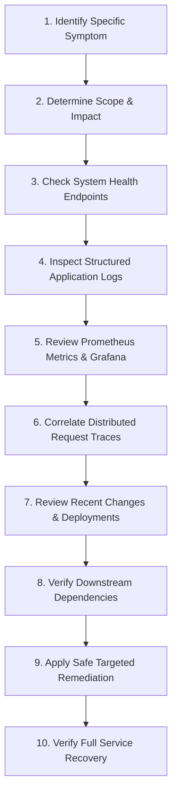

# Operational Troubleshooting Framework & Diagnostic Methodology

This document outlines the systematic troubleshooting framework, forensic log analysis, and diagnostic methodology for resolving infrastructure, backend, database, and machine learning issues in the **Finance & Security: Real-Time Fraud & Anomaly Detection Platform**.

---

## 1. Universal Diagnostic Methodology

When investigating an operational failure or performance degradation, follow the structured 10-step diagnostic framework:



---

## 2. Fast Diagnostic Commands (Docker / Production)

### 2.1 Container & Service Inspection
```bash
# Check container statuses and restart counts
docker ps --format "table {{.Names}}\t{{.Status}}\t{{.Ports}}"

# Inspect live container resource utilization
docker stats --no-stream
```

### 2.2 Application Log Inspection
```bash
# Stream backend application logs (filter by ERROR/WARN)
docker logs -f --tail=200 fraudshield-prod-backend | grep -E "ERROR|CRITICAL"

# Stream reverse proxy logs
docker logs -f --tail=100 fraudshield-prod-proxy
```

### 2.3 Database Connectivity & Connection Inspection
```bash
# Test PostgreSQL connection directly
docker exec -it fraudshield-prod-postgres pg_isready -U fraudshield_app -d fraudshield_prod

# Check active database queries and locks
docker exec -it fraudshield-prod-postgres psql -U fraudshield_app -d fraudshield_prod -c "
SELECT pid, usename, state, query_start, age(clock_timestamp(), query_start) AS duration, query 
FROM pg_stat_activity 
WHERE state != 'idle' 
ORDER BY query_start ASC 
LIMIT 10;
"
```

### 2.4 Redis Cache & Ingestion Queue Inspection
```bash
# Test Redis responsiveness
docker exec -it fraudshield-prod-redis redis-cli ping

# Check Redis memory and connected clients
docker exec -it fraudshield-prod-redis redis-cli info memory
docker exec -it fraudshield-prod-redis redis-cli info clients
```

---

## 3. Root Cause Analysis (RCA) Guidelines

* **Correlate with Deployment Timelines**: Always check git commit history and CI release logs (`git log -n 5`) to determine if the issue began immediately after a code or rule change.
* **Correlate with Traffic Volume**: Check Prometheus metrics to see if the degradation coincided with a 10x traffic spike or high-velocity injection test.
* **Preserve Forensic Evidence**: Never restart or destroy container instances without first capturing crash logs, thread dumps, and database connection statistics.
