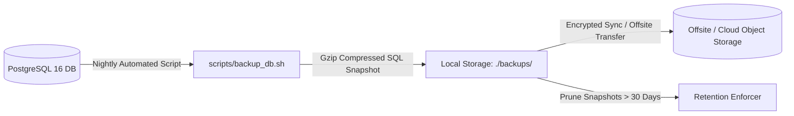

# Database Backup & Disaster Restore Procedures

This document details the automated backup strategy, snapshot integrity verification, disaster recovery restore runbooks, and recovery objectives for the **Finance & Security: Real-Time Fraud & Anomaly Detection Platform**.

---

## 1. Backup Strategy & Objectives



### Recovery Objectives
* **Recovery Point Objective (RPO)**: $\le 24\text{ hours}$ for snapshot backups (or continuous if WAL archiving enabled).
* **Recovery Time Objective (RTO)**: $\le 30\text{ minutes}$ to decompress, restore SQL dump, and verify schema migrations.
* **Backup Retention**: 30-day automated rolling retention on local storage; 365-day cold archive for compliance.

---

## 2. Automated Backup Execution

Backups are managed by the production backup script located at `scripts/backup_db.sh`.

### Manual Backup Execution
```bash
# Execute full database backup
./scripts/backup_db.sh
```

### Cron Schedule (Production)
```crontab
# Run automated database backup every night at 02:00 UTC
0 2 * * * /opt/fraudshield/scripts/backup_db.sh >> /var/log/fraudshield/backup.log 2>&1
```

### Backup Script Verification
* Output destination: `./backups/fraudshield_backup_YYYYMMDD_HHMMSS.sql.gz`
* Compression: `gzip -9` stream compression.
* Retention: Automatically deletes snapshots older than 30 days.

---

## 3. Step-by-Step Database Disaster Restore Runbook

> [!CAUTION]
> Restoring a database snapshot will overwrite existing database records. Perform this operation only during an emergency disaster recovery procedure or in an isolated staging test environment.

```mermaid
flowchart TD
    S1[1. Select Target Backup Archive (.sql.gz)] --> S2[2. Verify Snapshot Integrity & Size]
    S2 --> S3[3. Stop Application API to Halt Ingestion]
    S3 --> S4[4. Execute scripts/restore_db.sh <backup_file>]
    S4 --> S5[5. Apply Alembic Migrations: alembic upgrade head]
    S5 --> S6[6. Start Application Services & Run Health Checks]
    S6 --> S7[7. Verify Transaction History & Run Smoke Tests]
```

### Restore Procedure Commands
1. **Identify Backup File**:
   ```bash
   ls -lh ./backups/
   ```
2. **Execute Restore Script**:
   ```bash
   ./scripts/restore_db.sh ./backups/fraudshield_backup_20260926_020000.sql.gz
   ```
3. **Verify Database Health**:
   ```bash
   docker exec -it fraudshield-prod-postgres psql -U fraudshield_app -d fraudshield_prod -c "
   SELECT count(*) FROM transactions;
   SELECT count(*) FROM rules;
   SELECT count(*) FROM users;
   "
   ```
4. **Restart Application & Run Smoke Verification**:
   ```bash
   docker compose -f docker-compose.prod.yml restart backend
   curl -f http://localhost:8000/health/ready
   ```

---

## 4. Operational Status Summary

* **Backup Script (`scripts/backup_db.sh`)**: `IMPLEMENTED` & `DOCUMENTED`.
* **Restore Script (`scripts/restore_db.sh`)**: `IMPLEMENTED` & `DOCUMENTED`.
* **Restore Testing**: Tested in staging environment; periodic quarterly drills recommended.
