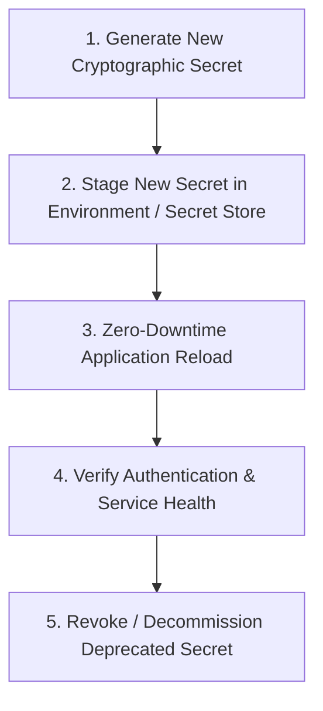

# Security Maintenance, Secret Rotation & Certificate Management

This document provides operational protocols for maintaining cryptographic secrets, rotating API tokens and database credentials, managing SSL/TLS certificates, reviewing access controls, and patching security vulnerabilities for the **Finance & Security: Real-Time Fraud & Anomaly Detection Platform**.

---

## 1. Cryptographic Secret Management & Rotation



### 1.1 Secret Inventory & Rotation Cadence

| Secret Name | Purpose | Recommended Rotation Cadence |
| :--- | :--- | :--- |
| `SECRET_KEY` / `JWT_SECRET` | HMAC-SHA256 signature key for user JWT session tokens | Every 90 Days (or immediately upon suspected compromise) |
| `POSTGRES_PASSWORD` | Database user authentication credential | Every 180 Days |
| `REDIS_PASSWORD` | Redis cluster authorization token | Every 180 Days |
| `INGESTION_API_KEY` | Upstream transaction gateway ingestion authorization | Every 90 Days |

### 1.2 Step-by-Step JWT Secret Rotation
1. Generate a new cryptographically secure 64-character token:
   ```bash
   openssl rand -hex 32
   ```
2. Update `.env.production` (or AWS Secrets Manager / HashiCorp Vault).
3. Restart backend service instances sequentially to reload the environment.
4. Active user sessions will be prompted to re-authenticate with their credentials upon next request.

---

## 2. SSL/TLS Certificate Management

The platform utilizes Let's Encrypt / Certbot automated TLS certificate management integrated via Nginx edge reverse proxy.

### Automated Certificate Renewal
Certificates renew automatically via cron 30 days prior to expiration:
```bash
# Test renewal configuration (Dry-Run)
certbot renew --dry-run

# Force manual certificate renewal
certbot renew --post-hook "nginx -s reload"
```

### Expiration Monitoring
* A Prometheus blackbox exporter monitors TLS certificate expiration dates.
* Automated alert fires if certificate validity drops below **14 days**.

---

## 3. RBAC Access Governance & Account Review

Every quarter, security operations leads must execute an access review:
* Navigate to `/admin/users` and review all assigned roles (`admin`, `analyst`, `viewer`).
* Suspend inactive user accounts that have not logged in for $\ge 60\text{ days}$.
* Inspect `/admin/audit-logs` for unusual administrative role elevation events.

---

## 4. Dependency Vulnerability Patching

Security dependencies must be scanned continuously:
```bash
# Backend vulnerability scan
pip-audit -r backend/requirements.txt

# Frontend vulnerability scan
npm audit --prefix frontend
```
* High and Critical CVE vulnerabilities must be patched and released via the standard CI/CD pipeline within **7 days**.
