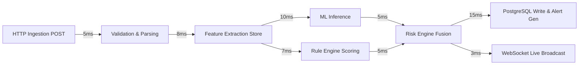

# Performance Maintenance & Latency Tuning

This document provides capacity management guidelines, latency profiling techniques, bottleneck identification workflows, and resource allocation targets for the **Finance & Security: Real-Time Fraud & Anomaly Detection Platform**.

---

## 1. Latency Budgets & Service Level Objectives (SLOs)



### End-to-End Latency Target
* **Target P95**: $\le 50\text{ ms}$
* **Target P99**: $\le 100\text{ ms}$
* **Maximum Throughput (Single Node)**: $1,000\text{ transactions / second}$

---

## 2. Capacity Monitoring & Bottleneck Identification

| Subsystem | Primary Resource Metric | Saturation Threshold | Bottleneck Remediation |
| :--- | :--- | :--- | :--- |
| **API Web Workers** | CPU Utilization / Thread Pool | $> 75\%$ sustained | Scale Uvicorn worker count (`WEB_CONCURRENCY=4`) |
| **PostgreSQL Database** | Active Connections / IOPS | Pool $> 80\%$, Disk IOPS $> 85\%$ | Enable connection pooling, optimize B-tree indexes |
| **Redis Cache** | Memory Used / Eviction Rate | $> 80\%$ Max Memory | Increase memory limit or tune TTLs on velocity keys |
| **ML Inference** | CPU Time per Inference | $> 20\text{ms}$ | Vectorize feature transformations, reduce tree depth |

---

## 3. Systematic Bottleneck Diagnostic Workflow

When end-to-end ingestion latency exceeds 100ms:

```mermaid
flowchart TD
    LAT[Latency Spike Alert Fired (P95 > 100ms)] --> B1{Check Database Latency}
    B1 -->|Slow Queries > 50ms| REM1[Analyze EXPLAIN ANALYZE & Missing Indexes]
    B1 -->|DB Fast < 10ms| B2{Check ML Inference Time}
    B2 -->|ML Inference > 25ms| REM2[Profile Feature Pipeline & Memory Bloat]
    B2 -->|ML Fast < 10ms| B3{Check Redis Latency & Queue Depth}
    B3 -->|Redis Timeout / Lag| REM3[Flush Stale Keys / Scale Redis]
    B3 -->|Redis Fast| REM4[Check External Upstream Network & TLS Latency]
```

---

## 4. Performance Tuning Best Practices

1. **Database Index Maintenance**: Ensure composite indexes exist on high-frequency filter columns (`(user_id, created_at)`). Run `EXPLAIN (ANALYZE, BUFFERS)` on slow queries.
2. **Asynchronous Non-Blocking I/O**: Ensure all database queries utilize asynchronous sessions (`AsyncSession` + asyncpg) without synchronous blocking calls in FastAPI async route handlers.
3. **Redis Key Expiration**: Ensure temporary rolling velocity keys expire automatically (`TTL = 3600s` for 1h counters, `TTL = 86400s` for 24h counters) to prevent memory leaks.
