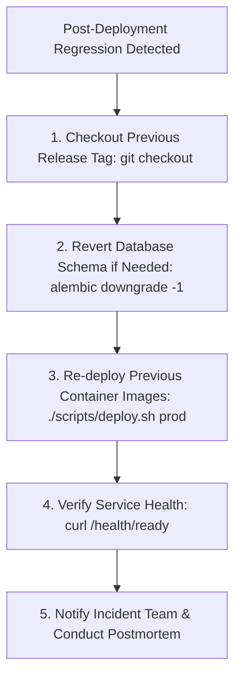

# Release, Upgrade & Update Operations

This document defines the zero-downtime deployment process, database migration execution order, staging validation requirements, and emergency rollback procedures for the **Finance & Security: Real-Time Fraud & Anomaly Detection Platform**.

---

## 1. Release & Deployment Pipeline

The platform uses a standardized, automated release pipeline integrated with GitHub Actions CI/CD and Docker Compose deployment scripts (`scripts/deploy.sh` / `scripts/deploy.ps1`).

```mermaid
flowchart LR
    DEV[Feature Branch / PR] --> CI[Automated CI & Security Gate]
    CI --> STG[Deploy Staging (docker-compose.staging.yml)]
    STG --> SMOKE[Smoke Tests & Ingestion Validation]
    SMOKE --> PROD[Production Rolling Release (scripts/deploy.sh)]
    PROD --> HEALTH[Automated Health & Ready Check]
    HEALTH -->|Pass| DONE[Release Complete]
    HEALTH -->|Fail| ROLL[Automated Rollback to Previous Tag]
```

---

## 2. Pre-Release Checklist

Before promoting any release tag to production:
* [ ] All unit, integration, and security tests pass in CI without warnings.
* [ ] Any new Alembic schema migrations have been validated on staging with zero table locks.
* [ ] If the release includes a new ML model artifact, verify inference latency ($< 15\text{ms}$) and anomaly calibration.
* [ ] An automated database backup snapshot has been captured prior to deployment (`./scripts/backup_db.sh`).

---

## 3. Step-by-Step Production Release Execution

### 1. Capture Pre-Deployment Snapshot
```bash
./scripts/backup_db.sh
```

### 2. Execute Automated Deployment Script
```bash
# Execute deployment in production mode
./scripts/deploy.sh prod
```

### Script Execution Sequence:
1. Pulls latest production Docker images.
2. Applies pending Alembic database migrations:
   ```bash
   docker compose -f docker-compose.prod.yml run --rm backend alembic upgrade head
   ```
3. Performs zero-downtime rolling restart of backend API workers.
4. Updates static SPA frontend assets in Nginx edge container.
5. Executes automated health check against `http://localhost:8000/health/ready`.

---

## 4. Emergency Rollback Procedures

If a deployment fails health checks or introduces an operational regression:



### Rollback Commands
```bash
# Revert to previous Git release tag
git checkout v1.2.0

# Downgrade database schema if migration caused the failure
docker compose -f docker-compose.prod.yml run --rm backend alembic downgrade -1

# Redeploy previous stable containers
./scripts/deploy.sh prod
```
