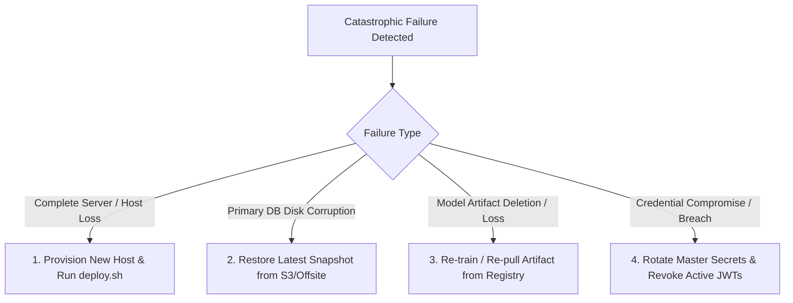

# Disaster Recovery & Catastrophe Playbook

This document defines disaster recovery procedures, failover protocols, data loss scenarios, and recovery drill methodologies for the **Finance & Security: Real-Time Fraud & Anomaly Detection Platform**.

---

## 1. Disaster Recovery Scenarios & Immediate Actions



### Catastrophic Scenario Playbooks

| Disaster Scenario | Impact Level | Immediate Action | Recovery Procedure | Target RTO |
| :--- | :--- | :--- | :--- | :--- |
| **Primary Host Total Loss** | Critical | Redirect DNS to standby DR host | Clone repository, deploy Docker stack, apply latest database snapshot | $\le 60\text{ mins}$ |
| **Database Corruption / Data Loss** | Critical | Stop backend API immediately to prevent bad writes | Run `scripts/restore_db.sh` using latest valid backup snapshot | $\le 30\text{ mins}$ |
| **Redis Cache Eviction / Failure** | High | Restart Redis container | Ingestion continues; sliding velocity counters re-populate in 1 hour | $\le 5\text{ mins}$ |
| **Model Registry Artifact Loss** | High | Fall back to rule-based detection | Run `python ml/train.py` to regenerate baseline Isolation Forest artifact | $\le 15\text{ mins}$ |
| **Admin Credential Compromise** | Critical | Suspend compromised account via DB | Rotate `SECRET_KEY`, restart backend to invalidate all sessions | $\le 10\text{ mins}$ |

---

## 2. Disaster Recovery Drill Methodology

To validate operational preparedness, the SRE team conducts quarterly disaster recovery drills:

```mermaid
flowchart LR
    STG[Staging Environment] --> SIM[Inject Catastrophic Failure: docker stop db]
    SIM --> TIM[Start Disaster Stopwatch (Measure RTO/RPO)]
    TIM --> REST[Execute scripts/restore_db.sh]
    REST --> SMOKE[Run End-to-End Smoke Tests]
    SMOKE --> DOC[Record Measured RTO / RPO & Lessons Learned]
```

### Standard Drill Protocol
1. **Simulation**: Execute in a clean staging environment. Simulate data corruption by stopping database and dropping tables.
2. **Execution**: On-call engineer restores database using `scripts/restore_db.sh`.
3. **Validation**: Run automated API health probes and ingest 50 test transactions.
4. **Debrief**: Measure time from incident injection to full recovery. Document findings in the DR log.
