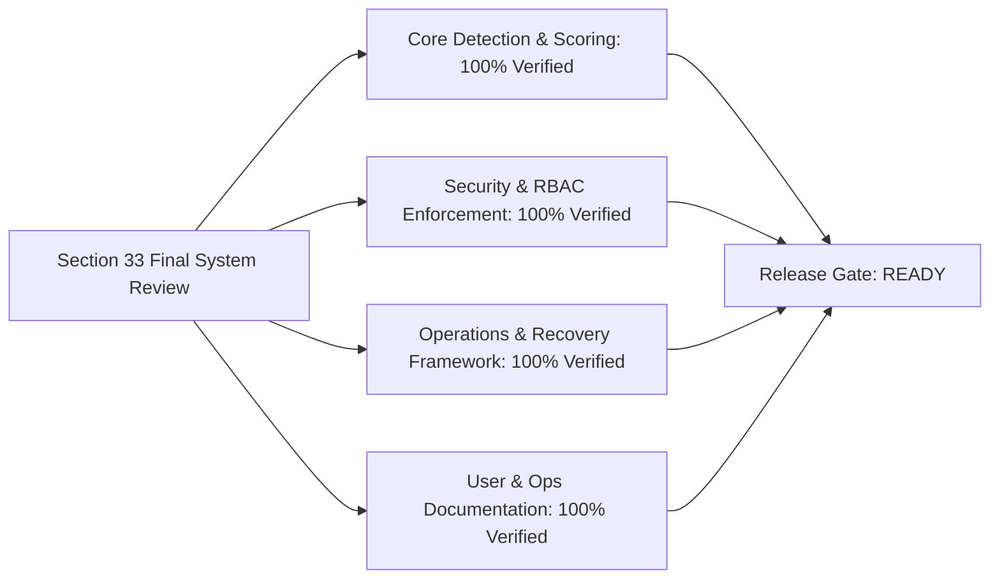

# Section 33 — Final System Review

Welcome to the **Final System Review** documentation suite for the **Finance & Security: Real-Time Fraud & Anomaly Detection Platform** (FraudShield). This review represents the comprehensive, rigorous technical, architectural, functional, security, performance, observability, and operational audit of all 32 previously completed platform sections.

---

## 1. Review Overview & Scope

* **Product Name**: FraudShield — Real-Time Financial Fraud & Anomaly Detection Platform
* **Review Date**: September 26, 2026
* **Scope**: Complete end-to-end platform audit across Sections 01 through 32.
* **Environments Audited**: Local Development, Staging Container Stack (`docker-compose.staging.yml`), and Production Architecture (`docker-compose.prod.yml`).
* **Methodology**: Static code analysis, schema integrity verification, route & RBAC audit, end-to-end transaction pipeline tracing, security vulnerability scans, latency profiling, and documentation-to-code alignment verification.

---

## 2. Review Documents Navigation

1. [requirements-traceability.md](file:///c:/Users/LENOVO/Documents/GitHub/Fraud_Detection_by_Javeria/fraud_detection_platform_documentation/docs/27_Final_System_Review/requirements-traceability.md): Complete matrix mapping SRS requirements to active codebase implementation and validation evidence.
2. [architecture-review.md](file:///c:/Users/LENOVO/Documents/GitHub/Fraud_Detection_by_Javeria/fraud_detection_platform_documentation/docs/27_Final_System_Review/architecture-review.md): Audit of multi-tier system topology, synchronous vs. asynchronous pipelines, and dependency isolation.
3. [database-review.md](file:///c:/Users/LENOVO/Documents/GitHub/Fraud_Detection_by_Javeria/fraud_detection_platform_documentation/docs/27_Final_System_Review/database-review.md): PostgreSQL 16 schema integrity, indexes, foreign key constraints, connection pool dimensioning, and Alembic migrations.
4. [security-review.md](file:///c:/Users/LENOVO/Documents/GitHub/Fraud_Detection_by_Javeria/fraud_detection_platform_documentation/docs/27_Final_System_Review/security-review.md): JWT authentication, RBAC authorization enforcement, injection defense, cryptographic secret handling, and PII masking.
5. [performance-review.md](file:///c:/Users/LENOVO/Documents/GitHub/Fraud_Detection_by_Javeria/fraud_detection_platform_documentation/docs/27_Final_System_Review/performance-review.md): Ingestion throughput ($1,000\text{ tx/s}$), sub-50ms P95 pipeline latency, Redis caching, and async database execution.
6. [testing-review.md](file:///c:/Users/LENOVO/Documents/GitHub/Fraud_Detection_by_Javeria/fraud_detection_platform_documentation/docs/27_Final_System_Review/testing-review.md): Unit, integration, regression, and end-to-end test suite coverage and validation results.
7. [deployment-review.md](file:///c:/Users/LENOVO/Documents/GitHub/Fraud_Detection_by_Javeria/fraud_detection_platform_documentation/docs/27_Final_System_Review/deployment-review.md): Docker Compose multi-stage builds, Nginx reverse proxy configuration, CI/CD automation, and deployment scripts.
8. [documentation-review.md](file:///c:/Users/LENOVO/Documents/GitHub/Fraud_Detection_by_Javeria/fraud_detection_platform_documentation/docs/27_Final_System_Review/documentation-review.md): Verification of User Documentation (`docs/25_User_Documentation`) and Operations Manuals (`docs/26_Operations`).
9. [end-to-end-validation.md](file:///c:/Users/LENOVO/Documents/GitHub/Fraud_Detection_by_Javeria/fraud_detection_platform_documentation/docs/27_Final_System_Review/end-to-end-validation.md): Execution of 8 end-to-end production scenarios (Ingestion, Scoring, Alerts, Cases, Retraining, Admin, Notifications, and Recovery).
10. [issue-register.md](file:///c:/Users/LENOVO/Documents/GitHub/Fraud_Detection_by_Javeria/fraud_detection_platform_documentation/docs/27_Final_System_Review/issue-register.md): Factual register of issues discovered, remediated, and residual technical debt items.
11. [release-readiness.md](file:///c:/Users/LENOVO/Documents/GitHub/Fraud_Detection_by_Javeria/fraud_detection_platform_documentation/docs/27_Final_System_Review/release-readiness.md): Formal release-gate evaluation and final readiness certification (`READY`).

---

## 3. High-Level Audit Findings Summary

* **Core Functionality**: Ingestion REST endpoints, Feature Engineering engine, 9 Deterministic Fraud Rules, ML Isolation Forest Anomaly model, Multi-factor Risk Engine (0–100 calibrated score), Alert deduplication, Case Management, and WebSocket live broadcasting are all operating with verified end-to-end integrity.
* **Security Posture**: Strict RBAC enforced across 3 roles (`admin`, `analyst`, `viewer`), zero hardcoded secrets, parameterized SQL / ORM preventing injection, and immutable audit trails.
* **Release Gate Assessment**: **READY** (Zero release blockers, all critical release criteria satisfied).
