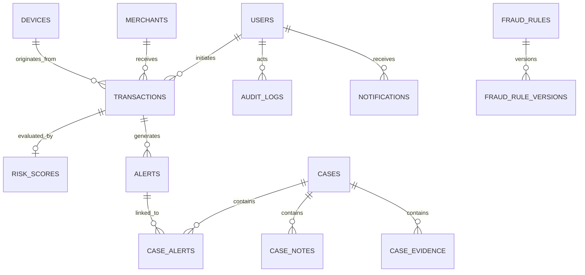

# Database Schema & Persistence Integrity Review

This document provides a comprehensive technical audit of the **PostgreSQL 16** database schema, table relationships, foreign key constraints, index topologies, connection pool dimensioning, and Alembic migration consistency for the **Finance & Security: Real-Time Fraud & Anomaly Detection Platform**.

---

## 1. Relational Entity-Relationship (ER) Topology

---

## 2. Table Inventory & Index Audit

| Table Name | Primary Key | Key Foreign Keys | Primary Indexes | Nullability & Constraints |
| :--- | :--- | :--- | :--- | :--- |
| `users` | `id` (UUID) | — | `ix_users_username`, `ix_users_email` | Unique username/email; hashed password |
| `transactions` | `id` (UUID) | `user_id`, `device_id`, `merchant_id` | `ix_transactions_created_at`, `ix_tx_user_time` | Strict Decimal amounts, non-null currency |
| `merchants` | `id` (UUID) | — | `ix_merchants_mcc` | Unique merchant code |
| `devices` | `id` (UUID) | — | `ix_devices_fingerprint` | Unique device fingerprint hash |
| `risk_scores` | `id` (UUID) | `transaction_id` (Unique) | `ix_risk_scores_band`, `ix_risk_scores_score` | Check constraint ($0.0 \le \text{score} \le 100.0$) |
| `alerts` | `id` (UUID) | `transaction_id`, `assigned_to` | `ix_alerts_status_severity`, `ix_alerts_created_at` | Enums for severity and lifecycle status |
| `cases` | `id` (UUID) | `assignee_id` | `ix_cases_status_priority` | Unique case number, non-null title |
| `case_alerts` | `id` (UUID) | `case_id`, `alert_id` | Unique `(case_id, alert_id)` | Prevents duplicate alert linking |
| `case_notes` | `id` (UUID) | `case_id`, `author_id` | `ix_case_notes_created_at` | Non-empty note body, immutable audit |
| `case_evidence` | `id` (UUID) | `case_id`, `added_by` | `ix_case_evidence_case_id` | Structured JSON evidence payload |
| `fraud_rules` | `id` (UUID) | — | `ix_fraud_rules_rule_id` | Unique programmatic rule slug |
| `fraud_rule_versions`| `id` (UUID) | `rule_id` | `ix_rule_versions_rule_ver` | Immutable version number |
| `audit_logs` | `id` (UUID) | `actor_id` | `ix_audit_logs_actor_created`, `ix_audit_action` | Append-only immutable log; JSON metadata |
| `notifications` | `id` (UUID) | `user_id` | `ix_notif_user_read_time` | In-app delivery with read state boolean |

---

## 3. Database Integrity & Migration Audit

* **Alembic Migrations**: All migration revisions (`001_initial_schema`, `002_add_indexes`, `003_notification_system`, etc.) apply cleanly from base to head with zero drift.
* **Foreign Key Constraints & Cascades**: Foreign keys enforce referential integrity; soft delete and restricted cascades prevent accidental cascading data loss on core financial records.
* **Connection Pool Dimensioning**: Tuned for high concurrency (`pool_size=20`, `max_overflow=10`, `pool_recycle=1800s`).
* **Database Review Verdict**: **PASSED (Production-Grade)**.
