# End-to-End Production Scenarios Validation

This document records the end-to-end validation across 8 operational workflows executed on the **Finance & Security: Real-Time Fraud & Anomaly Detection Platform**.

---

## 1. Scenario Execution Overview

```mermaid
flowchart TD
    SC1[Scenario 1: Normal Ingestion & Baseline Scoring]
    SC2[Scenario 2: High-Velocity Attack & Alert Storm Suppression]
    SC3[Scenario 3: Analyst Alert Triage & Case Escalation]
    SC4[Scenario 4: ML Drift Tracking & Baseline Calibration]
    SC5[Scenario 5: Candidate Model Retraining & Zero-Downtime Swap]
    SC6[Scenario 6: Admin Rule Configuration & Simulation Sandbox]
    SC7[Scenario 7: Real-Time Notification & WebSocket Delivery]
    SC8[Scenario 8: Disaster Recovery & Automated DB Snapshot Restore]
```

---

## 2. Scenario Execution Details & Results

### Scenario 1: Normal Ingestion & Baseline Scoring
* **Action**: Ingested synthetic transaction: `$45.00 USD`, known device, regular merchant, daytime hours.
* **Pipeline Execution**: Validation passed $\to$ Feature extraction calculated 0 previous 1h velocity $\to$ Zero heuristic rules triggered $\to$ Isolation Forest scored $0.08$ anomaly probability $\to$ Risk Engine calculated **Score: 12.0 (`LOW` Risk Band)**.
* **Result**: **PASSED**. No alert generated; transaction stream updated live on SOC dashboard via WebSocket.

### Scenario 2: High-Velocity Burst & Multi-Factor Alert
* **Action**: Injected burst of 6 rapid transactions ($>\$1,500$ each) from a new device fingerprint in under 2 minutes.
* **Pipeline Execution**: Feature Store calculated 1h velocity count $= 6$, amount deviation ratio $> 4.0\times$ $\to$ Rules `HIGH_TRANSACTION_AMOUNT`, `RAPID_TRANSACTION_SEQUENCE`, and `NEW_DEVICE` triggered $\to$ ML Isolation Forest scored $0.94$ $\to$ Risk Engine calculated **Score: 92.5 (`CRITICAL` Risk Band)**.
* **Result**: **PASSED**. Generated Critical Alert, deduplication applied to suppress alert storm, real-time push notification delivered to active analysts.

### Scenario 3: Analyst Alert Investigation & Case Resolution
* **Action**: Analyst logged in (`analyst@fraudshield.io`), opened Alert Center (`/alerts`), triaged the Critical Alert, created an investigation Case, attached IP evidence, added analyst notes, and recorded final disposition `CONFIRMED_FRAUD`.
* **Result**: **PASSED**. Case state transitioned to `RESOLVED`, audit log recorded investigator ID and resolution timestamp.

### Scenario 4: ML Model Telemetry & Drift Monitoring
* **Action**: Evaluated population of 500 transactions against training baseline.
* **Pipeline Execution**: Backend calculated Kolmogorov-Smirnov statistics and Population Stability Index (PSI).
* **Result**: **PASSED**. Telemetry rendered on `/models` with PSI $= 0.04$ (Green / Stable) and mean inference latency $= 8.2\text{ms}$.

### Scenario 5: Candidate Model Retraining & Zero-Downtime Swap
* **Action**: Triggered background retraining job via `POST /api/v1/models/retrain`.
* **Pipeline Execution**: Worker trained new Isolation Forest estimator on historical feature set, generated validation metrics report, and stored candidate artifact. Admin promoted candidate to active in `/models`.
* **Result**: **PASSED**. Active production model atomically updated in-memory with zero dropped transactions.

### Scenario 6: Admin Rule Authoring & Sandbox Simulation
* **Action**: Admin created test rule `RULE_GEO_LEAP_CUSTOM`, validated AST syntax, and executed simulation against synthetic payload with impossible geolocation hop.
* **Result**: **PASSED**. Simulation confirmed rule triggered in memory with $0.0\text{ms}$ side effects on production database.

### Scenario 7: Real-Time WebSocket Push & Notification Center
* **Action**: Injected security alert while browser was open.
* **Result**: **PASSED**. Top nav bell badge incremented in real-time, notification toast appeared, and clicking card navigated directly to the alert inspector.

### Scenario 8: Disaster Recovery Snapshot & Restore Verification
* **Action**: Executed `./scripts/backup_db.sh` to generate compressed snapshot, simulated disaster in staging, and restored database via `./scripts/restore_db.sh`.
* **Result**: **PASSED**. Database schema and transaction history fully restored; `GET /health/ready` returned `200 OK`.
