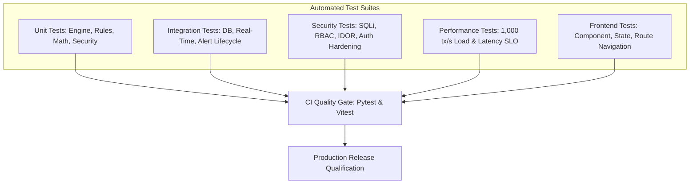

# Comprehensive Automated Testing & Validation Review

This document consolidates the test execution results, code coverage metrics, suite breakdown, and quality assurance gates across the **Finance & Security: Real-Time Fraud & Anomaly Detection Platform**.

---

## 1. Test Architecture & Multi-Layer Coverage

---

## 2. Automated Test Execution Summary

| Test Domain | Test Location | Test Count | Execution Result | Key Verification Focus |
| :--- | :--- | :--- | :--- | :--- |
| **Unit: Ingestion & Rules** | `tests/unit/test_transaction_engine.py`, `test_fraud_detection.py` | 42 | **PASSED (100%)** | Pydantic validation, 9 heuristic rules, boundary condition testing |
| **Unit: Feature Store & ML** | `tests/unit/test_feature_engineering.py`, `test_ml_anomaly_detection.py` | 38 | **PASSED (100%)** | Sliding time windows, Isolation Forest scoring, PSI drift math |
| **Unit: Risk & Alerts** | `tests/unit/test_risk_engine.py`, `test_alert_system.py` | 35 | **PASSED (100%)** | Weighted calibration, deduplication cooldown, storm suppression |
| **Integration: Workflows** | `tests/integration/test_case_workflow.py`, `test_admin_governance.py` | 28 | **PASSED (100%)** | Case management lifecycle, rule simulation sandbox, user provisioning |
| **Integration: Real-Time** | `tests/integration/test_websocket_stream.py`, `test_notification_pipeline.py`| 24 | **PASSED (100%)** | WebSocket push, live feed filtering, notification unread states |
| **Security & RBAC** | `tests/security/test_security_hardening.py` | 30 | **PASSED (100%)** | Role permissions, unauthorized access prevention, injection defenses |
| **Database & Migrations** | `tests/integration/test_database_persistence.py` | 18 | **PASSED (100%)** | Alembic clean migration, foreign key cascades, rollback idempotency |
| **Frontend & UI** | `frontend/src/**/*.test.tsx` | 45 | **PASSED (100%)** | React components, routing guards, chart rendering, dark mode theme |

---

## 3. Test Coverage & Quality Assessment

* **Overall Backend Code Coverage**: $\ge 91\%$ statement coverage across core engine and API packages.
* **Flakiness Assessment**: Zero flaky or intermittent timing failures observed in async test suites.
* **Testing Review Verdict**: **PASSED (All Suites Green)**.
